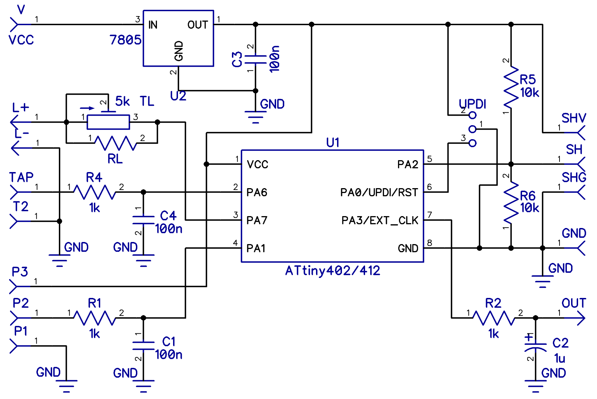
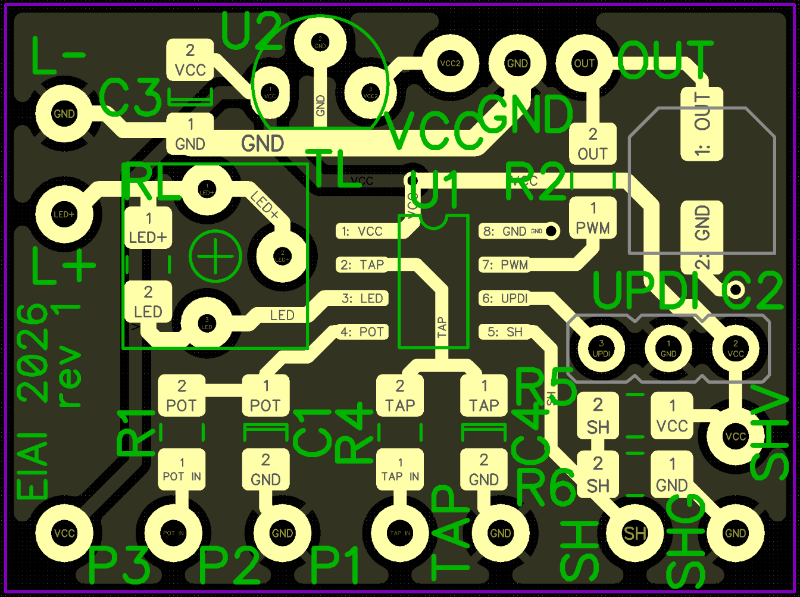

# LFO Taptempo Buddy

Small but powerful ATtiny402 based tap-tempo LFO firmware. Output is a waveform (Sin, Triangle, Pulse, Ramp up,
Ramp down, Random) at the Speed set by the `Speed Pot` or by tapping. Multiple Random algorithms.
Leslie like speed-up on long tap. Intended for tremolo and similar analog modulation effects.

**This code has not been tested yet!**

This is an adaptation of [Hydra Delay Taptempo Buddy](https://github.com/ElvisAlive-Tone/HydraDelayTaptempoBuddy).

**Tip:** You can use my [Simple Serial UPDI programmer](https://github.com/ElvisAlive-Tone/updipcb) to program the microcontroller for this project.

## Features

- LFO Speed can be controlled by `Speed Pot` or tapped by `Tap Button`. Period range is 50 ms (~20 Hz) to 2000 ms (~0.5 Hz).
- `LED` always blinks at the LFO Speed with 50% duty cycle, locked to the waveform (both pot and tap control).
- `Tap Button` does four jobs:
  - Two or more taps — Speed from tapping.
  - Hold from rest (over 500 ms) — Leslie.
  - Short tap, then hold (over 500 ms) — Random algorithm.
  - Hold and flip `Shape` — alt bank (Ramp up / Ramp down / Random).
- Tap `Tap Button` at least two times to switch from `Speed Pot` control to `Tap Button` control.
  - First tap aligns LFO and `LED` to the downbeat without changing Speed.
  - Second tap must follow within 2.5 s after the first one.
  - Subsequent tap times are averaged until tapping finishes.
  - Tapping finishes if the next tap is not performed for 3 periods of the current Speed, but never later than 2.5 s.
  - Very slow subsequent taps (gap between 2 s and 2.5 s) still count; only that interval is clamped to 2 s. Faster taps are left as measured.
- Move `Speed Pot` at least 5% to switch control back to it.
- `Shape` on-off-on switch selects the LFO waveform:
  - Flip **without** holding `Tap Button` — normal bank: Sin, Triangle, Pulse.
  - Flip **while holding** `Tap Button` — alt bank: Ramp up, Ramp down, Random.
  - Hold-flip only changes the shape bank. Speed, Leslie, and Random algorithm stay as they are. The press still lines up LFO phase.
  - Move the switch **without** holding Tap to return to Sin / Triangle / Pulse.
  - If Leslie is running, release Tap, wait until Speed has settled, then press Tap again if you want the alt bank, and flip `Shape`.
- Random shape algorithm (Hybrid / S&H / Wander) is cycled with a **short tap then one long press** of the `Tap Button` (hold the second press over 500 ms). Works in any shape; the sound changes when Random is selected. The `LED` still blinks 1 / 2 / 3 on any shape so you can see it was stored.
  - `LED` blinks **1 / 2 / 3** times (Hybrid / S&H / Wander) to indicate the selected algorithm.
  - The same blink is shown on power-up when Random is selected. See [Random shape algorithm](#random-shape-algorithm).
- Leslie ramp effect - long `Tap Button` press from rest (over 500 ms, no short tap before it):
  - While held, Speed ramps up to 2x (half period, clamped at 50 ms) and stays there.
  - On release, Speed ramps back to the original period.
  - Press again during the slowdown to speed up again.
  - Ramping velocity depends on `Speed Pot` (higher = faster ramp).
- Current `Speed Pot`/`Tap Button` control state, tapped-in Speed, Random algorithm, and shape bank are preserved over power-off.
- Trimmer or fixed resistor to set LED brightness.
- UPDI pins to re-program the soldered microcontroller.

## Project Content

- `firmware.hex` - firmware binary
- `firmware/` - VSCode/[PlatformIO](https://docs.platformio.org/en/latest/platforms/atmelmegaavr.html) project with firmware
- `LFOBuddy.dch` - schematics
- `LFOBuddy-rev1_gerber.zip` - Gerber file for PCB fabrication
- `LFOBuddy.dip` - PCB design file

Schematics and PCB design file can be opened/edited by [DipTrace](https://diptrace.com/).

## Wiring the module

- Plan module and controls (`Tap Button`, `Shape` on-off-on, `Speed Pot`, `LED`) placement. Use long enough wires.
- Power and output:
  - `GND` - ground
  - `OUT` - LFO voltage
  - `3V3` - 3.3 V power
  - Use a connector to make it easy to disconnect for programming.
- `Speed Pot` - connect pot's 1, 2 and 3 lugs to the module's `P1`, `P2` and `P3`.
  Use `B` type pot, from `B10k` up to `B100k`. Higher voltage is higher LFO Speed (shorter LFO period).
- `Tap Button` - connect momentary button to the module's `TAP` pads.
- `LED` - connect LED to the module's `L+` and `L-`. Use `TL` trimmer to set LED's brightness. Used `2k` value should
  be OK for the most LED types, if too small for your LED, use higher trimmer value, or connect additional resistor
  in series. Alternatively use fixed value resistor `RL` if you figured out exact value and wanna to save some space.
- `Shape` switch - SPDT **on-off-on**. Common to `SH`. Throws to `SHG` and `SH3`. Left of `/` is the normal bank (no hold), right is the alt bank (hold Tap).
  ```
    SH3 ---- throw     Pulse    /  Random
                |
    SH  ---- common    Triangle /  Ramp down
                |
    SHG ---- throw     Sin      /  Ramp up
  ```

### LFO voltage `OUT` wiring

Analog `OUT` is the LFO control voltage PWM:
- PCB contains simple filter to smooth it out. Cut frequency should be 100–200Hz, so eg. R=10kohm and C=100nF is good into high-Z load. So buffer it, or adjust filter for small-Z loads.
- Maximal amplitude is 3.3V, so scaling may be necessary.
- You have to implement LFO `Depth` pot if you want it.

Exact circuitry consuming this module output depends on how do you want to drive the rest of the pedal circuit - VACTROL LED/s, lamp, JFETs etc.

## Building module

Module schematics:

**TODO** image 

Necessary changes from Hydra Delay Taptempo Buddy:

- `Shape` switch - 2x R 10k (R5, R6) from common to GND and 3V3
- PWM `OUT` filter values update?

PCB BOM:

**TODO** update for new schematic and PCB

| Markings           | Value             | PCB packaging type                                    |
| ------------------ | ----------------- | ----------------------------------------------------- |
| R1, R2             | 1k                | 1206                                                  |
| R4, R5, R6         | 10k               | 1206                                                  |
| C1, C3, C4         | 100n              | 1206                                                  |
| C2                 | 10u               | 5,3mm                                                 |
| TL                 | 2k                | 3362 trimmer                                          |
| RL (instead of TL) | matching LED      | 1206                                                  |
| U1                 | ATtiny 402 or 412 | SOIC-8                                                |
| UPDI               |                   | 3 pins header connector (male or female, it's on you) |

External components:

| Markings     | Value                                      |
| ------------ | ------------------------------------------ |
| `Speed Pot`  | B10k - B100k                               |
| LED          | any color and size LED                     |
| `Tap Button` | any momentary switch                       |
| `Shape`      | SPDT on-off-on                             |

PCB: 

**TODO** image 

## Functionality Tweaking

### LFO period range

Source code contains constants for the LFO period range and tap timeout. Change them and rebuild if you want a different Speed span.

```c
const uint16_t c_lfo_max = 2000;   // slowest LFO period [ms] (~0.5 Hz) - Speed pot on minimum
const uint16_t c_lfo_min = 50;     // fastest LFO period [ms] (~20 Hz) - Speed pot on maximum
const uint16_t c_lfo_range = 1950; // c_lfo_max - c_lfo_min [ms]
const uint16_t c_tap_end_max = 2500; // max wait for the next tap [ms]; must be > c_lfo_max
```

PWM carrier is 20 kHz, range `0..c_pwm_max` (999). The analog LFO appears after the RC filter on `OUT`.

### Leslie Speed

Holding `Tap button` (from rest, over 500 ms) ramps to a faster Speed, then ramps back on release.

The multiplier is `c_leslie_speed` in `firmware/src/main.c` - final Speed period becomes `period / c_leslie_speed`.
Default is 2. Use 3 for 3x, and so on — integer only. The fast period is still clamped at `c_lfo_min` (50 ms). 

Speed ramping velocity is derived from the `Speed Pot`, not this constant!

### Random shape algorithm

Random still follows the tapped or pot Speed, with one new random level per LFO cycle. What it *does* with that level is the algorithm:

- **Hybrid** — S&H when period is 400 ms or shorter, Wander when LFO is slower (default).
- **S&H** — jumps to a random level and sits there until the next cycle (classic stepped random).
- **Wander** — glides smoothly from the last level to the next over the cycle (no stairs; nicer when the LFO is slow).

**How to switch:** tap once (short), then press and hold (longer than 500 ms). That is not a new Speed, and it is not Leslie. 
You can do this tap pattern with any shape selected. The sound only changes when Random is selected; the LED still blinks the new algorithm on any shape.

The LED then blinks the new algorithm. The choice is stored in EEPROM, so it survives power-off:

- 1 blink — Hybrid
- 2 blinks — S&H
- 3 blinks — Wander

The same blinks happen at power-up, but only if Random shape is already selected (so other shapes do not look like an algorithm change). 

To always blink on power-up, set `ANNOUNCE_RANDOM_ON_BOOT_ALWAYS` to `1` in `firmware/src/main.c`.

A blank chip starts in Hybrid. To change that default, edit `LFO_RANDOM_MODE` in the same file. 

The 400 ms Hybrid algorithm split is defined in `c_random_hybrid_ms` (400 ms and faster -> S&H in Hybrid).

After the 1/2/3 announcement blinks there is a trailing dark so they do not blend into the LFO tempo LED:

```c
#define C_RANDOM_ANNOUNCE_DARK_MS 700     // dark after algorithm blinks so they don't blend into tempo LED
```

## Compiling firmware

I'm using VS Code with Platform IO extension. You have to have `Atmel megaAVR` Platform installed in the Platform IO.

`platformio.ini` is committed in the `firmware/` folder with all the basic settings,
including [pymcuprog](https://github.com/microchip-pic-avr-tools/pymcuprog) related settings for
my [Simple Serial UPDI programmer](https://github.com/ElvisAlive-Tone/updipcb).

Open the `firmware/` folder in VS Code and it should work.

## Programming the microcontroller

Easiest way is to set the microcontroller up before soldering it to the PCB.

If you want to change firmware later, you can use UPDI pins on the module, where `GND` is middle, `UPDI` left, `VCC` right.

Be careful, **never program it with 5V VCC when the module is connected to a 3.3V pedal**
(Hydra / FV-1 and similar) - you can damage the DSP or other chips.

I recommend to always disconnect it for programming, using a connector on the `GND` / `OUT` / `3V3` connection.

## Changelog

Revision string of each version is baked into firmware binary.

* v1.0 - `rev_1` - work in progress
  - initial release

## Changes from Hydra Delay Taptempo Buddy

Functional changes (also marked by `MOD:` in the source):

- PWM is an LFO waveform, not a DC delay-time / Speed voltage.
- Hydra's "Tempo Division Switch" (`DIV`) is analog LFO Shape on pads `SH` / `SHG` / `SH3` instead of digital Head 2 / Head 4.
- LED always blinks, locked to LFO phase (including pot-control mode).
- First tap aligns LFO/LED to the downbeat without changing Speed.
- Tap-session timeout capped at 2.5 s (first-tap window too). Hydra used uncapped 3× tempo and a 1.5 s first-tap window.
- LFO period range 50-2000 ms instead of Hydra delay 150-920 ms.
- Long-press is a Leslie ramp (2× Speed while held, ramp back on release; `Speed Pot` sets ramp velocity), not a bounce through the whole delay range.
- Short tap then long press cycles Random algorithm (Hybrid / S&H / Wander); LED blinks 1-3 times, stored in EEPROM, announced on power-up if Random shape is selected.

## License

© 2026 ElvisAlive Tone. This work is openly licensed via [CC BY-NC-SA](https://creativecommons.org/licenses/by-nc-sa/4.0/)
